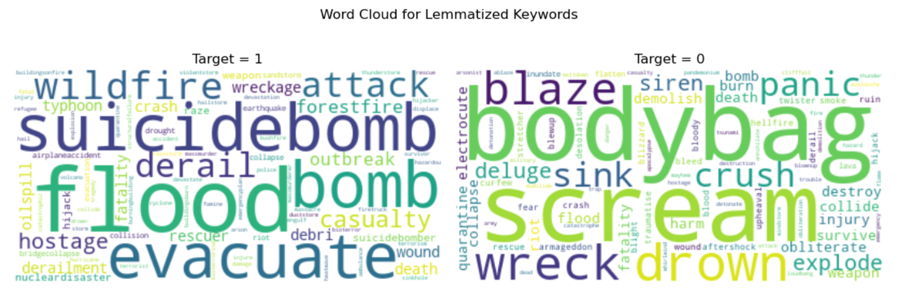
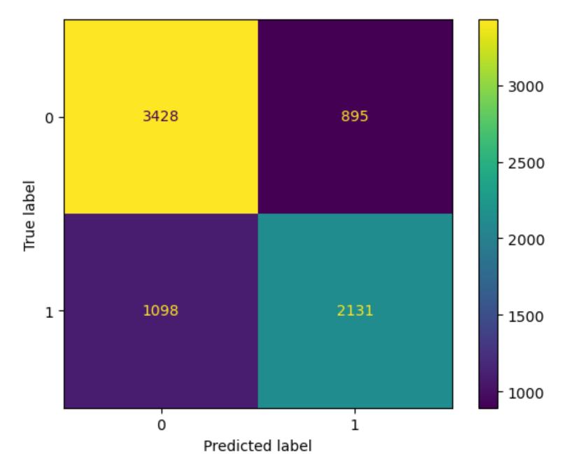
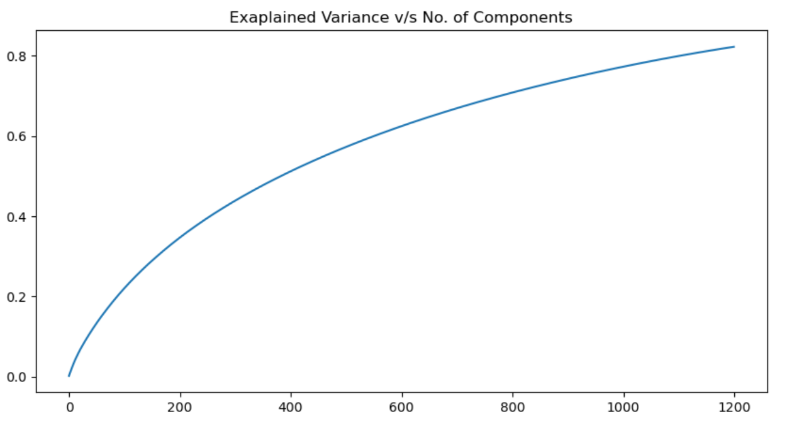

# kaggle_disaster_tweets
Natural Language Processing with Disaster Tweets (Kaggle Competition for Getting Started)

Based on my recently developing interest in decision science and NLP, I decided to choose this project to revise some previously learned ML skills and start building a GitHub portfolio.

## Clean and Prep the data

The first step was to load and study the data. We have a training set of 7613 tweets, out of which all 7552 (~99%) have a keyword tag but nearly 33% are missing location tags. Additionally, in this dataset, every tweet has been classified as a disaster tweet (target = 1) or not (target = 0).

### Data Cleaning

In order to be able to better analyze the tweets, we removed the following from the tweet texts:
1. Puncutation
2. Special Characters
3. URL links
4. Numbers
5. Emojis

After cleaning the tweet texts, we lemmatize the words in the tweets using the *pattern* library. 

## Preliminary Analysis

Before building out any classification models, I wanted to dive into the data a little bit deeper.

### Keywords 
Since all of the tweets in the training and test data have been tagged with a keyword, the first thing that I want to look at is the difference in the most frewuent keywords for tweets that were characterized as disaster vs those that were not. As you can see in the image below, there seems to be a clear difference between the keywords of disaster vs regular tweets.

One example that stands out is the word *bodybag*, which in most cases was used in tweets related to fashion, rather than disaster.

## Models

### Logistic Regression using Keyword only
The very first model we build is a very simple one that aims to classify the tweet solely based on the keywords. We have 177 unique keywords in the training dataset, and used a one-hot encoding to create a data frame of size 7552x177.

**Advantages**: Easy to implement and understand - the coefficients give us a clear intuition of which words increase the probability of the tweet being about an actual disaster vs not.

**Disadvantages**: 
1. Limited vocabulary. If there is a keyword in the test/validation dataset that we didnt encounter in the training dataset, the model would not know how to handle it.
2. We are not using any of the information in the actual text of the tweets.
3. In any real world application, we would probably have a dataset comprising just the tweet without any keyword attached to it. Limits the application of this model.

### Classification using TF-IDF Vectorizer
At this stage, we are ready to build more complicated models using the actual text in the tweets. 

#### Vectorization
The first step is to vectorize the tweet text, and for that we use a TF-IDF vectorizer with ngrams between length 1 and 3. Based on hyperparameters of min and max df, we get a corpus of length 4849, excluding english stopwords.

#### PCA (or Truncated SVD)
Since we only have ~7500 observations, we need to reduce the dimensionality of this dataset in order to be able to correctly train the model.
For this, we use the truncated svd model because we have a sparse dataset.

We can see that with 1000 principal components, we are able to capture about 80% of the variance. This has reduced the dimensionality of our dataset to about 1/4th of what it was before.

#### Models: Logistic Regression, KNN, Decision Tree

